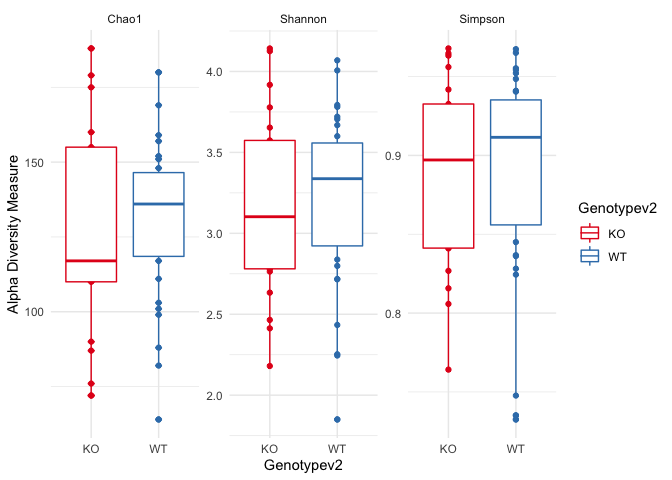
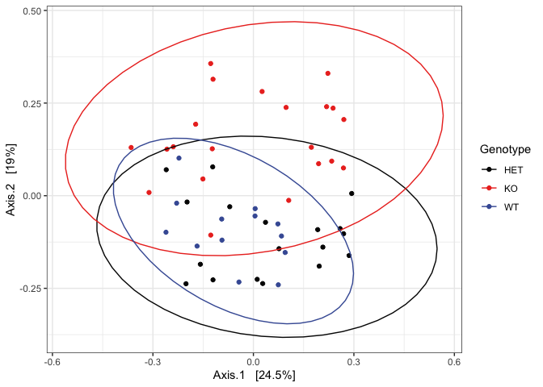
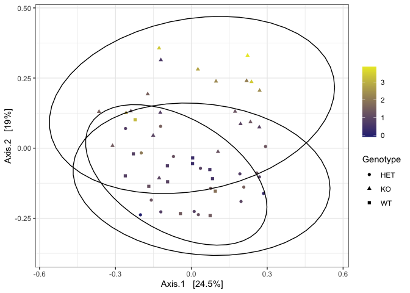
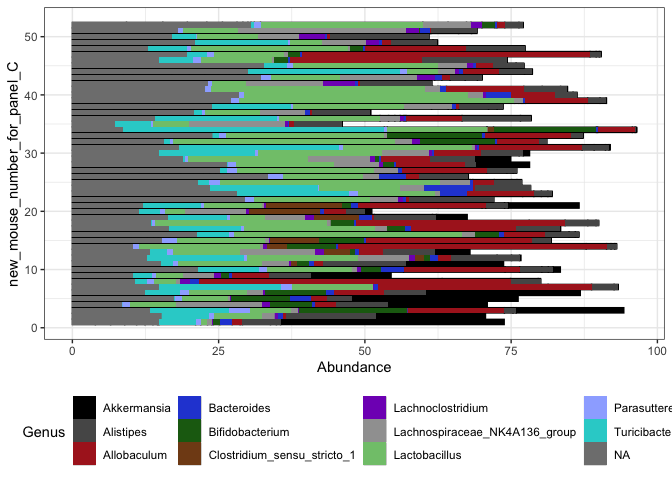
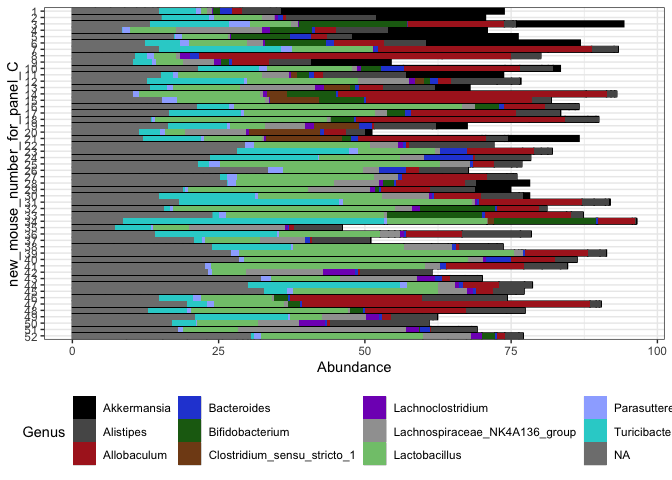

Hnf4a Manuscript Figure 5
================

Loading packages

``` r
#Loading required libraries
library(ggplot2)
library(plyr)
library(tidyverse)
```

    ## ── Attaching packages ─────────────────────────────────────── tidyverse 1.3.2 ──
    ## ✔ tibble  3.1.8      ✔ dplyr   1.0.10
    ## ✔ tidyr   1.2.1      ✔ stringr 1.4.1 
    ## ✔ readr   2.1.3      ✔ forcats 0.5.2 
    ## ✔ purrr   0.3.5      
    ## ── Conflicts ────────────────────────────────────────── tidyverse_conflicts() ──
    ## ✖ dplyr::arrange()   masks plyr::arrange()
    ## ✖ purrr::compact()   masks plyr::compact()
    ## ✖ dplyr::count()     masks plyr::count()
    ## ✖ dplyr::failwith()  masks plyr::failwith()
    ## ✖ dplyr::filter()    masks stats::filter()
    ## ✖ dplyr::id()        masks plyr::id()
    ## ✖ dplyr::lag()       masks stats::lag()
    ## ✖ dplyr::mutate()    masks plyr::mutate()
    ## ✖ dplyr::rename()    masks plyr::rename()
    ## ✖ dplyr::summarise() masks plyr::summarise()
    ## ✖ dplyr::summarize() masks plyr::summarize()

``` r
library(phyloseq) #To open phyloseq objects output by Hardac
library(RColorBrewer) 
library(pals) #Improved color palette options
library(ggpubr) #Improved ggplot functions
```

    ## 
    ## Attaching package: 'ggpubr'
    ## 
    ## The following object is masked from 'package:plyr':
    ## 
    ##     mutate

``` r
library(vegan)
```

    ## Loading required package: permute
    ## Loading required package: lattice
    ## This is vegan 2.6-2

``` r
library(DESeq2)
```

    ## Loading required package: S4Vectors
    ## Loading required package: stats4
    ## Loading required package: BiocGenerics
    ## 
    ## Attaching package: 'BiocGenerics'
    ## 
    ## The following objects are masked from 'package:dplyr':
    ## 
    ##     combine, intersect, setdiff, union
    ## 
    ## The following objects are masked from 'package:stats':
    ## 
    ##     IQR, mad, sd, var, xtabs
    ## 
    ## The following objects are masked from 'package:base':
    ## 
    ##     anyDuplicated, append, as.data.frame, basename, cbind, colnames,
    ##     dirname, do.call, duplicated, eval, evalq, Filter, Find, get, grep,
    ##     grepl, intersect, is.unsorted, lapply, Map, mapply, match, mget,
    ##     order, paste, pmax, pmax.int, pmin, pmin.int, Position, rank,
    ##     rbind, Reduce, rownames, sapply, setdiff, sort, table, tapply,
    ##     union, unique, unsplit, which.max, which.min
    ## 
    ## 
    ## Attaching package: 'S4Vectors'
    ## 
    ## The following objects are masked from 'package:dplyr':
    ## 
    ##     first, rename
    ## 
    ## The following object is masked from 'package:tidyr':
    ## 
    ##     expand
    ## 
    ## The following object is masked from 'package:plyr':
    ## 
    ##     rename
    ## 
    ## The following objects are masked from 'package:base':
    ## 
    ##     expand.grid, I, unname
    ## 
    ## Loading required package: IRanges
    ## 
    ## Attaching package: 'IRanges'
    ## 
    ## The following object is masked from 'package:phyloseq':
    ## 
    ##     distance
    ## 
    ## The following objects are masked from 'package:dplyr':
    ## 
    ##     collapse, desc, slice
    ## 
    ## The following object is masked from 'package:purrr':
    ## 
    ##     reduce
    ## 
    ## The following object is masked from 'package:plyr':
    ## 
    ##     desc
    ## 
    ## Loading required package: GenomicRanges
    ## Loading required package: GenomeInfoDb
    ## Loading required package: SummarizedExperiment
    ## Loading required package: MatrixGenerics
    ## Loading required package: matrixStats
    ## 
    ## Attaching package: 'matrixStats'
    ## 
    ## The following object is masked from 'package:dplyr':
    ## 
    ##     count
    ## 
    ## The following object is masked from 'package:plyr':
    ## 
    ##     count
    ## 
    ## 
    ## Attaching package: 'MatrixGenerics'
    ## 
    ## The following objects are masked from 'package:matrixStats':
    ## 
    ##     colAlls, colAnyNAs, colAnys, colAvgsPerRowSet, colCollapse,
    ##     colCounts, colCummaxs, colCummins, colCumprods, colCumsums,
    ##     colDiffs, colIQRDiffs, colIQRs, colLogSumExps, colMadDiffs,
    ##     colMads, colMaxs, colMeans2, colMedians, colMins, colOrderStats,
    ##     colProds, colQuantiles, colRanges, colRanks, colSdDiffs, colSds,
    ##     colSums2, colTabulates, colVarDiffs, colVars, colWeightedMads,
    ##     colWeightedMeans, colWeightedMedians, colWeightedSds,
    ##     colWeightedVars, rowAlls, rowAnyNAs, rowAnys, rowAvgsPerColSet,
    ##     rowCollapse, rowCounts, rowCummaxs, rowCummins, rowCumprods,
    ##     rowCumsums, rowDiffs, rowIQRDiffs, rowIQRs, rowLogSumExps,
    ##     rowMadDiffs, rowMads, rowMaxs, rowMeans2, rowMedians, rowMins,
    ##     rowOrderStats, rowProds, rowQuantiles, rowRanges, rowRanks,
    ##     rowSdDiffs, rowSds, rowSums2, rowTabulates, rowVarDiffs, rowVars,
    ##     rowWeightedMads, rowWeightedMeans, rowWeightedMedians,
    ##     rowWeightedSds, rowWeightedVars
    ## 
    ## Loading required package: Biobase
    ## Welcome to Bioconductor
    ## 
    ##     Vignettes contain introductory material; view with
    ##     'browseVignettes()'. To cite Bioconductor, see
    ##     'citation("Biobase")', and for packages 'citation("pkgname")'.
    ## 
    ## 
    ## Attaching package: 'Biobase'
    ## 
    ## The following object is masked from 'package:MatrixGenerics':
    ## 
    ##     rowMedians
    ## 
    ## The following objects are masked from 'package:matrixStats':
    ## 
    ##     anyMissing, rowMedians
    ## 
    ## The following object is masked from 'package:phyloseq':
    ## 
    ##     sampleNames

Alpha Diversity

``` r
ps2 <- read_rds("phyloseq_v2.rds")
ps2
```

    ## phyloseq-class experiment-level object
    ## otu_table()   OTU Table:         [ 844 taxa and 64 samples ]
    ## sample_data() Sample Data:       [ 64 samples by 22 sample variables ]
    ## tax_table()   Taxonomy Table:    [ 844 taxa by 7 taxonomic ranks ]
    ## refseq()      DNAStringSet:      [ 844 reference sequences ]

What does the sample_data look like?

``` r
df1 <- ps2@sam_data
head(df1)
```

    ##    X.SampleID experiment_number new_mouse_number_for_panel_C mouse_number
    ## 1           1                 3                            1            1
    ## 10         10                 3                           39           22
    ## 11         11                 3                           40           23
    ## 12         12                 4                           11            1
    ## 13         13                 4                           12            2
    ## 14         14                 4                           14            4
    ##    Genotype Mouse.age..wks. sample_date date_extracted kit_lot fecal_wt note
    ## 1        KO              52       43684          44294  207377   0.0408     
    ## 10      HET              52       43684          44294  207377   0.0234     
    ## 11      HET              52       43684          44294  207377   0.0163     
    ## 12       KO              52       43907          44294  207377   0.0255     
    ## 13       KO              52       43907          44294  207377   0.0258     
    ## 14       KO              52       43907          44294  207377   0.0299     
    ##    flaring inflamed diarrhea diarrhea_score lipocalin_ng mouse_wt  pf_yield
    ## 1        N        Y        Y              2 7313.9942390     26.9 136273422
    ## 10       N        N        N              0    0.8192842     29.3 103464208
    ## 11       N        N        N              0    6.4629661     25.6 138336140
    ## 12       N        N        N              0   17.6071227     30.1 123082368
    ## 13       N        N        N              0   17.0971810     30.4 126987426
    ## 14       N        N        N              0   35.5633870     27.6 123554248
    ##    pf_clusters   q30 avg_quality_score      barcode
    ## 1       271461 74.20             31.64 CCGTAAGACCAG
    ## 10      206104 73.07             31.40 CTTCAGTTCGCC
    ## 11      275570 73.83             31.56 AGCTTCGATTCA
    ## 12      245184 74.78             31.76 GATACGTCCTGA
    ## 13      252963 73.98             31.61 TCATACTGCTAG
    ## 14      246124 72.69             31.34 ACTCTCAAGTGG

First, we need to group HET and WT mice to compare alpha and beta div
between WT and KO mice

``` r
#Removing negative controls
ps2.noctrl = subset_samples(ps2, !is.na(mouse_number))
ps2.noctrl
```

    ## phyloseq-class experiment-level object
    ## otu_table()   OTU Table:         [ 844 taxa and 58 samples ]
    ## sample_data() Sample Data:       [ 58 samples by 22 sample variables ]
    ## tax_table()   Taxonomy Table:    [ 844 taxa by 7 taxonomic ranks ]
    ## refseq()      DNAStringSet:      [ 844 reference sequences ]

``` r
#Removing positive controls
ps2.noctrlv2 = subset_samples(ps2.noctrl, note != "positive control")
ps2.noctrlv2
```

    ## phyloseq-class experiment-level object
    ## otu_table()   OTU Table:         [ 844 taxa and 52 samples ]
    ## sample_data() Sample Data:       [ 52 samples by 22 sample variables ]
    ## tax_table()   Taxonomy Table:    [ 844 taxa by 7 taxonomic ranks ]
    ## refseq()      DNAStringSet:      [ 844 reference sequences ]

``` r
#Copying the genotype variable
ps2.noctrlv2@sam_data$Genotypev2 <- ps2.noctrlv2@sam_data$Genotype
ps2.noctrlv2
```

    ## phyloseq-class experiment-level object
    ## otu_table()   OTU Table:         [ 844 taxa and 52 samples ]
    ## sample_data() Sample Data:       [ 52 samples by 23 sample variables ]
    ## tax_table()   Taxonomy Table:    [ 844 taxa by 7 taxonomic ranks ]
    ## refseq()      DNAStringSet:      [ 844 reference sequences ]

``` r
ps2.noctrlv2@sam_data$Genotypev2 <- gsub("HET", "WT", ps2.noctrlv2@sam_data$Genotypev2)
```

Let us look at the new sample data header

``` r
df2 <- ps2.noctrlv2@sam_data
head(df2)
```

    ##    X.SampleID experiment_number new_mouse_number_for_panel_C mouse_number
    ## 1           1                 3                            1            1
    ## 10         10                 3                           39           22
    ## 11         11                 3                           40           23
    ## 12         12                 4                           11            1
    ## 13         13                 4                           12            2
    ## 14         14                 4                           14            4
    ##    Genotype Mouse.age..wks. sample_date date_extracted kit_lot fecal_wt note
    ## 1        KO              52       43684          44294  207377   0.0408     
    ## 10      HET              52       43684          44294  207377   0.0234     
    ## 11      HET              52       43684          44294  207377   0.0163     
    ## 12       KO              52       43907          44294  207377   0.0255     
    ## 13       KO              52       43907          44294  207377   0.0258     
    ## 14       KO              52       43907          44294  207377   0.0299     
    ##    flaring inflamed diarrhea diarrhea_score lipocalin_ng mouse_wt  pf_yield
    ## 1        N        Y        Y              2 7313.9942390     26.9 136273422
    ## 10       N        N        N              0    0.8192842     29.3 103464208
    ## 11       N        N        N              0    6.4629661     25.6 138336140
    ## 12       N        N        N              0   17.6071227     30.1 123082368
    ## 13       N        N        N              0   17.0971810     30.4 126987426
    ## 14       N        N        N              0   35.5633870     27.6 123554248
    ##    pf_clusters   q30 avg_quality_score      barcode Genotypev2
    ## 1       271461 74.20             31.64 CCGTAAGACCAG         KO
    ## 10      206104 73.07             31.40 CTTCAGTTCGCC         WT
    ## 11      275570 73.83             31.56 AGCTTCGATTCA         WT
    ## 12      245184 74.78             31.76 GATACGTCCTGA         KO
    ## 13      252963 73.98             31.61 TCATACTGCTAG         KO
    ## 14      246124 72.69             31.34 ACTCTCAAGTGG         KO

``` r
#Let us confirm that all HETs were converted to WT
 df2[["Genotypev2"]]
```

    ##  [1] "KO" "WT" "WT" "KO" "KO" "KO" "KO" "KO" "KO" "WT" "WT" "KO" "WT" "WT" "WT"
    ## [16] "WT" "WT" "WT" "KO" "KO" "KO" "KO" "KO" "KO" "KO" "WT" "WT" "WT" "WT" "WT"
    ## [31] "WT" "KO" "KO" "KO" "KO" "KO" "KO" "WT" "WT" "WT" "WT" "WT" "WT" "WT" "WT"
    ## [46] "WT" "WT" "WT" "WT" "WT" "WT" "WT"

``` r
df1[["Genotype"]]
```

    ##  [1] "KO"  "HET" "HET" "KO"  "KO"  "KO"  "KO"  "KO"  "KO"  "WT"  "WT"  "KO" 
    ## [13] "WT"  "HET" "HET" "HET" "HET" "HET" "KO"  "KO"  "KO"  "KO"  "KO"  "KO" 
    ## [25] "KO"  "WT"  "WT"  "WT"  "HET" "HET" "HET" "KO"  "KO"  "KO"  "KO"  "KO" 
    ## [37] "KO"  "WT"  "WT"  "KO"  "KO"  "WT"  "KO"  "WT"  "HET" "HET" "WT"  "HET"
    ## [49] "HET" "HET" "WT"  "HET" "HET" "HET" NA    NA    "WT"  "WT"  "HET" "HET"
    ## [61] NA    NA    NA    NA

Data preprocessing for ordination. Rare and low abundance taxa can swamp
out major trends (E.g. Genotype)

``` r
sample_min_count = 50

ps2 %>%
  prune_samples(sample_sums(.)>=sample_min_count, .) ->
  ps2.sample_prune
```

``` r
min_count = 3
min_sample_frac = 0.10

prune.vec = filter_taxa(ps2.sample_prune, 
                       function(x) sum(x >= min_count) >= (min_sample_frac*length(x)))
ps2.st_prune = prune_taxa(prune.vec, ps2.sample_prune)
ntaxa(ps2.st_prune)
```

    ## [1] 265

``` r
ps2.st_prune.even = transform_sample_counts(ps2.st_prune, function(x) 1E6 * x/sum(x))
```

``` r
alpha_measures_all <- c("Shannon", "Chao1", "Simpson")
ga1 <- plot_richness(ps2.noctrlv2, measures = alpha_measures_all, x ="Genotypev2", color = "Genotypev2") + geom_boxplot() +theme_minimal() +scale_color_brewer(palette = "Set1")
```

    ## Warning in estimate_richness(physeq, split = TRUE, measures = measures): The data you have provided does not have
    ## any singletons. This is highly suspicious. Results of richness
    ## estimates (for example) are probably unreliable, or wrong, if you have already
    ## trimmed low-abundance taxa from the data.
    ## 
    ## We recommended that you find the un-trimmed data and retry.

``` r
ga1
```

<!-- -->

Are the differences in alpha div significant?

``` r
erich <- estimate_richness(ps2.noctrlv2, measures = c("Chao1","Shannon","Simpson"))
```

    ## Warning in estimate_richness(ps2.noctrlv2, measures = c("Chao1", "Shannon", : The data you have provided does not have
    ## any singletons. This is highly suspicious. Results of richness
    ## estimates (for example) are probably unreliable, or wrong, if you have already
    ## trimmed low-abundance taxa from the data.
    ## 
    ## We recommended that you find the un-trimmed data and retry.

``` r
ttest1 <- t(sapply(erich, function(x) unlist(kruskal.test(x~sample_data(ps2.noctrlv2)$Genotypev2)[c("estimate","p.value","statistic","conf.int")])))
ttest1
```

    ##            p.value statistic.Kruskal-Wallis chi-squared
    ## Chao1    0.6145005                           0.25367311
    ## se.chao1       NaN                                  NaN
    ## Shannon  0.6080525                           0.26302061
    ## Simpson  0.8447530                           0.03834449

Repeating for inflamed vs. non-inflamed mice

``` r
erich <- estimate_richness(ps2.noctrlv2, measures = c("Chao1","Shannon","Simpson"))
```

    ## Warning in estimate_richness(ps2.noctrlv2, measures = c("Chao1", "Shannon", : The data you have provided does not have
    ## any singletons. This is highly suspicious. Results of richness
    ## estimates (for example) are probably unreliable, or wrong, if you have already
    ## trimmed low-abundance taxa from the data.
    ## 
    ## We recommended that you find the un-trimmed data and retry.

``` r
ttest1 <- t(sapply(erich, function(x) unlist(kruskal.test(x~sample_data(ps2.noctrlv2)$inflamed)[c("estimate","p.value","statistic","conf.int")])))
ttest1
```

    ##            p.value statistic.Kruskal-Wallis chi-squared
    ## Chao1    0.2569980                             1.284856
    ## se.chao1       NaN                                  NaN
    ## Shannon  0.1492217                             2.080189
    ## Simpson  0.1804843                             1.793632

Beta Diversity

``` r
bc_dist = phyloseq::distance(ps2.noctrlv2, method="bray", weighted=F)
adonis2(bc_dist ~ sample_data(ps2.noctrlv2)$Genotypev2)
```

    ## Permutation test for adonis under reduced model
    ## Terms added sequentially (first to last)
    ## Permutation: free
    ## Number of permutations: 999
    ## 
    ## adonis2(formula = bc_dist ~ sample_data(ps2.noctrlv2)$Genotypev2)
    ##                                      Df SumOfSqs      R2      F Pr(>F)    
    ## sample_data(ps2.noctrlv2)$Genotypev2  1   0.8522 0.11185 6.2968  0.001 ***
    ## Residual                             50   6.7669 0.88815                  
    ## Total                                51   7.6191 1.00000                  
    ## ---
    ## Signif. codes:  0 '***' 0.001 '**' 0.01 '*' 0.05 '.' 0.1 ' ' 1

Repeating for inflamed vs. non-inflamed mice

``` r
bc_dist = phyloseq::distance(ps2.noctrlv2, method="bray", weighted=F)
adonis2(bc_dist ~ sample_data(ps2.noctrlv2)$inflamed)
```

    ## Permutation test for adonis under reduced model
    ## Terms added sequentially (first to last)
    ## Permutation: free
    ## Number of permutations: 999
    ## 
    ## adonis2(formula = bc_dist ~ sample_data(ps2.noctrlv2)$inflamed)
    ##                                    Df SumOfSqs      R2      F Pr(>F)   
    ## sample_data(ps2.noctrlv2)$inflamed  1   0.4340 0.05697 3.0203  0.004 **
    ## Residual                           50   7.1851 0.94303                 
    ## Total                              51   7.6191 1.00000                 
    ## ---
    ## Signif. codes:  0 '***' 0.001 '**' 0.01 '*' 0.05 '.' 0.1 ' ' 1

Panel 5A: PCoA plot colored according to genotype

``` r
ps2.st_prune.even
```

    ## phyloseq-class experiment-level object
    ## otu_table()   OTU Table:         [ 265 taxa and 64 samples ]
    ## sample_data() Sample Data:       [ 64 samples by 22 sample variables ]
    ## tax_table()   Taxonomy Table:    [ 265 taxa by 7 taxonomic ranks ]
    ## refseq()      DNAStringSet:      [ 265 reference sequences ]

Log transforming lipocalin (Lcn2) values

``` r
ps2.st_prune.even@sam_data$lipocalin_log <- log10(ps2.st_prune.even@sam_data$lipocalin_ng)
```

``` r
ps2.st_prune.even = subset_samples(ps2.st_prune.even, !is.na(mouse_number))
ps2.st_prune.even
```

    ## phyloseq-class experiment-level object
    ## otu_table()   OTU Table:         [ 265 taxa and 58 samples ]
    ## sample_data() Sample Data:       [ 58 samples by 23 sample variables ]
    ## tax_table()   Taxonomy Table:    [ 265 taxa by 7 taxonomic ranks ]
    ## refseq()      DNAStringSet:      [ 265 reference sequences ]

``` r
ps2.st_prune.even = subset_samples(ps2.st_prune.even, note != "positive control")
ps2.st_prune.even
```

    ## phyloseq-class experiment-level object
    ## otu_table()   OTU Table:         [ 265 taxa and 52 samples ]
    ## sample_data() Sample Data:       [ 52 samples by 23 sample variables ]
    ## tax_table()   Taxonomy Table:    [ 265 taxa by 7 taxonomic ranks ]
    ## refseq()      DNAStringSet:      [ 265 reference sequences ]

``` r
ps2.st_prune.even.pcoa_bc <- ordinate(ps2.st_prune.even, "PCoA", "bray")
p3test <- plot_ordination(ps2.st_prune.even, ps2.st_prune.even.pcoa_bc, type="samples", color="Genotype") + 
  stat_ellipse(type = "norm") +
  theme_bw() + scale_color_manual(values = c("#040404", "#ec3525", "#445ca4"))
p3test
```

<!-- -->

Panel 5B: PCoA plot colored according to log

``` r
p7testlog <- plot_ordination(ps2.st_prune.even, ps2.st_prune.even.pcoa_bc, type="samples", color = "lipocalin_log", shape = "Genotype") +
  scale_color_gradient(name = NULL,
                       high = "#eae82e",
                       low = "#2c2f81") +
stat_ellipse(type = "norm") +
  theme_bw()
p7testlog
```

<!-- -->

Panel 5C: Relative Abundance plot in the same order as the lipocalin
heatmap

``` r
#Should add up to 64 samples total, with controls removed it should be 52

ps2.pct = transform_sample_counts(ps2, function(x) 100 * x/sum(x))
ps2.pct
```

    ## phyloseq-class experiment-level object
    ## otu_table()   OTU Table:         [ 844 taxa and 64 samples ]
    ## sample_data() Sample Data:       [ 64 samples by 22 sample variables ]
    ## tax_table()   Taxonomy Table:    [ 844 taxa by 7 taxonomic ranks ]
    ## refseq()      DNAStringSet:      [ 844 reference sequences ]

``` r
ps2.pct.noctrl1 = subset_samples(ps2.pct, !is.na(new_mouse_number_for_panel_C))
ps2.pct.noctrl1
```

    ## phyloseq-class experiment-level object
    ## otu_table()   OTU Table:         [ 844 taxa and 52 samples ]
    ## sample_data() Sample Data:       [ 52 samples by 22 sample variables ]
    ## tax_table()   Taxonomy Table:    [ 844 taxa by 7 taxonomic ranks ]
    ## refseq()      DNAStringSet:      [ 844 reference sequences ]

``` r
ps2.pct.noctrl = subset_samples(ps2.pct.noctrl1, note == "")
ps2.pct.noctrl
```

    ## phyloseq-class experiment-level object
    ## otu_table()   OTU Table:         [ 844 taxa and 52 samples ]
    ## sample_data() Sample Data:       [ 52 samples by 22 sample variables ]
    ## tax_table()   Taxonomy Table:    [ 844 taxa by 7 taxonomic ranks ]
    ## refseq()      DNAStringSet:      [ 844 reference sequences ]

``` r
top25 <- names(sort(taxa_sums(ps2.pct.noctrl), decreasing=TRUE))[1:25]
ps.top25 <- prune_taxa(top25, ps2.pct.noctrl)
barplot2.2 <- plot_bar(ps.top25, x=as.character('new_mouse_number_for_panel_C'), fill = "Genus") + 
  geom_bar(stat = "identity", position = "stack", size=0)+ scale_fill_manual(values = as.vector(watlington())) + coord_flip() + theme_bw() +theme(legend.position = "bottom", legend.box = "horizontal")
barplot2.2
```

<!-- -->

``` r
barplot2.2$data$new_mouse_number_for_panel_C <- as.factor(barplot2.2$data$new_mouse_number_for_panel_C)
```

``` r
barplot2.2 + scale_x_discrete(limits=rev)
```

<!-- -->

Deseq2

``` r
hnf4a_dds <- phyloseq_to_deseq2(ps2.noctrlv2, ~ Genotypev2)
```

    ## converting counts to integer mode

    ## Warning in DESeqDataSet(se, design = design, ignoreRank): some variables in
    ## design formula are characters, converting to factors

``` r
hnf4a_dds
```

    ## class: DESeqDataSet 
    ## dim: 844 52 
    ## metadata(1): version
    ## assays(1): counts
    ## rownames(844): seq_1 seq_2 ... seq_843 seq_844
    ## rowData names(0):
    ## colnames(52): 1 10 ... 8 9
    ## colData names(23): X.SampleID experiment_number ... barcode Genotypev2

``` r
# First we remove rows with very few counts E.g. 5
hnf4a_dds <- hnf4a_dds[ rowSums(counts(hnf4a_dds)) > 5, ]
```

``` r
cts_hnf4a <- counts(hnf4a_dds)
geoMeans_hnf4a <- apply(cts_hnf4a, 1, function(row) if (all(row == 0)) 0 else exp(mean(log(row[row != 0]))))
dds_hnf4a <- estimateSizeFactors(hnf4a_dds, geoMeans=geoMeans_hnf4a)
```

``` r
dds_hnf4a <- DESeq(dds_hnf4a, test = "Wald", fitType = "parametric")
```

    ## using pre-existing size factors

    ## estimating dispersions

    ## gene-wise dispersion estimates

    ## mean-dispersion relationship

    ## final dispersion estimates

    ## fitting model and testing

    ## -- replacing outliers and refitting for 247 genes
    ## -- DESeq argument 'minReplicatesForReplace' = 7 
    ## -- original counts are preserved in counts(dds)

    ## estimating dispersions

    ## fitting model and testing

``` r
#Using the results table in Deseq2 to create a table with significant results for plotting and viewing this table to ensure it is properly formatted
res_hnf4a = results(dds_hnf4a, cooksCutoff = FALSE)
alpha = 0.01
sigtab_hnf4a = res_hnf4a[which(res_hnf4a$padj < alpha), ]
sigtab_hnf4a = cbind(as(sigtab_hnf4a, "data.frame"), as(tax_table(ps2.noctrlv2)[rownames(sigtab_hnf4a), ], "matrix"))
head(sigtab_hnf4a)
```

    ##         baseMean log2FoldChange     lfcSE       stat       pvalue         padj
    ## seq_20 828.86031     -12.885461 2.1973193  -5.864173 4.513754e-09 5.750130e-08
    ## seq_39  82.97182      25.470824 2.9738355   8.564974 1.081000e-17 2.111553e-16
    ## seq_40 266.78080     -28.933323 2.1866270 -13.231942 5.738485e-40 8.406881e-38
    ## seq_41 200.99214       2.109581 0.5939595   3.551725 3.827140e-04 4.004829e-03
    ## seq_79  82.55572     -27.284139 2.2947414 -11.889853 1.336408e-32 9.789190e-31
    ## seq_89  99.16649       7.423218 1.5377610   4.827290 1.384036e-06 1.622091e-05
    ##         Kingdom         Phylum               Class              Order
    ## seq_20 Bacteria     Firmicutes          Clostridia      Clostridiales
    ## seq_39 Bacteria Proteobacteria Deltaproteobacteria Desulfovibrionales
    ## seq_40 Bacteria     Firmicutes          Clostridia      Clostridiales
    ## seq_41 Bacteria     Firmicutes          Clostridia      Clostridiales
    ## seq_79 Bacteria    Tenericutes          Mollicutes     Mollicutes_RF9
    ## seq_89 Bacteria     Firmicutes          Clostridia      Clostridiales
    ##                     Family                       Genus Species
    ## seq_20    Clostridiaceae_1 Clostridium_sensu_stricto_1    <NA>
    ## seq_39 Desulfovibrionaceae               Desulfovibrio    <NA>
    ## seq_40    Clostridiaceae_1 Clostridium_sensu_stricto_1    <NA>
    ## seq_41     Lachnospiraceae                        <NA>    <NA>
    ## seq_79                <NA>                        <NA>    <NA>
    ## seq_89     Lachnospiraceae                        <NA>    <NA>

``` r
#Saving Deseq object as tab separated values
#write.table(sigtab_hnf4a, file = "Deseq2_hnf4a-flaring_WT-HET-vs-KO_ASV-names.tsv", row.names=TRUE, sep="\t")
```

``` r
#Which comparison is being made? This code shows that it is genotype "wt" vs "ko"
#The second line of code dim(sigtab) shows number of differential taxa at the chosen alpha
resultsNames(dds_hnf4a)
```

    ## [1] "Intercept"           "Genotypev2_WT_vs_KO"

``` r
dim(sigtab_hnf4a)
```

    ## [1] 29 13

Repeating the above for inflamed vs. non-inflamed KO mice

First, we need to remove all WT (Genotypev2) samples so we can compare
just the inflamed and non-inflamed KO mice

``` r
#Removing WT (Includes HET for Genotype2 variable)
ps2.noctrlv2_noWT = subset_samples(ps2.noctrlv2, Genotypev2 != "WT")
ps2.noctrlv2_noWT
```

    ## phyloseq-class experiment-level object
    ## otu_table()   OTU Table:         [ 844 taxa and 21 samples ]
    ## sample_data() Sample Data:       [ 21 samples by 23 sample variables ]
    ## tax_table()   Taxonomy Table:    [ 844 taxa by 7 taxonomic ranks ]
    ## refseq()      DNAStringSet:      [ 844 reference sequences ]

``` r
hnf4a_noWT_dds <- phyloseq_to_deseq2(ps2.noctrlv2_noWT, ~ inflamed)
```

    ## converting counts to integer mode

    ## Warning in DESeqDataSet(se, design = design, ignoreRank): some variables in
    ## design formula are characters, converting to factors

``` r
hnf4a_noWT_dds
```

    ## class: DESeqDataSet 
    ## dim: 844 21 
    ## metadata(1): version
    ## assays(1): counts
    ## rownames(844): seq_1 seq_2 ... seq_843 seq_844
    ## rowData names(0):
    ## colnames(21): 1 12 ... 41 42
    ## colData names(23): X.SampleID experiment_number ... barcode Genotypev2

``` r
# First we remove rows with very few counts E.g. 5
hnf4a_noWT_dds <- hnf4a_noWT_dds[ rowSums(counts(hnf4a_noWT_dds)) > 5, ]
```

``` r
cts_hnf4a_noWT <- counts(hnf4a_noWT_dds)
geoMeans_hnf4a_noWT <- apply(cts_hnf4a_noWT, 1, function(row) if (all(row == 0)) 0 else exp(mean(log(row[row != 0]))))
dds_hnf4a_noWT <- estimateSizeFactors(hnf4a_noWT_dds, geoMeans=geoMeans_hnf4a_noWT)
```

``` r
dds_hnf4a_noWT <- DESeq(dds_hnf4a_noWT, test = "Wald", fitType = "parametric")
```

    ## using pre-existing size factors

    ## estimating dispersions

    ## gene-wise dispersion estimates

    ## mean-dispersion relationship

    ## final dispersion estimates

    ## fitting model and testing

    ## -- replacing outliers and refitting for 163 genes
    ## -- DESeq argument 'minReplicatesForReplace' = 7 
    ## -- original counts are preserved in counts(dds)

    ## estimating dispersions

    ## fitting model and testing

``` r
#Using the results table in Deseq2 to create a table with significant results for plotting and viewing this table to ensure it is properly formatted
res_hnf4a_noWT = results(dds_hnf4a_noWT, cooksCutoff = FALSE)
alpha = 0.01
sigtab_hnf4a_noWT = res_hnf4a_noWT[which(res_hnf4a_noWT$padj < alpha), ]
sigtab_hnf4a_noWT = cbind(as(sigtab_hnf4a_noWT, "data.frame"), as(tax_table(ps2.noctrlv2_noWT)[rownames(sigtab_hnf4a_noWT), ], "matrix"))
head(sigtab_hnf4a_noWT)
```

    ##          baseMean log2FoldChange    lfcSE      stat       pvalue         padj
    ## seq_20 2062.62923      -27.40228 3.768501 -7.271400 3.557794e-13 1.202534e-10
    ## seq_40  665.10260      -25.86079 3.653115 -7.079106 1.450872e-12 2.451973e-10
    ## seq_44  259.54731      -10.61467 1.944582 -5.458585 4.799448e-08 1.143873e-06
    ## seq_50  466.48515      -11.46034 2.962329 -3.868692 1.094208e-04 1.761155e-03
    ## seq_80  187.80634      -23.87201 3.549770 -6.724946 1.756571e-11 1.979070e-09
    ## seq_83   29.61896      -21.61733 3.715220 -5.818586 5.934768e-09 2.026380e-07
    ##         Kingdom     Phylum      Class         Order           Family
    ## seq_20 Bacteria Firmicutes Clostridia Clostridiales Clostridiaceae_1
    ## seq_40 Bacteria Firmicutes Clostridia Clostridiales Clostridiaceae_1
    ## seq_44 Bacteria Firmicutes Clostridia Clostridiales  Lachnospiraceae
    ## seq_50 Bacteria Firmicutes Clostridia Clostridiales  Lachnospiraceae
    ## seq_80 Bacteria Firmicutes Clostridia Clostridiales  Lachnospiraceae
    ## seq_83 Bacteria Firmicutes Clostridia Clostridiales  Lachnospiraceae
    ##                              Genus Species
    ## seq_20 Clostridium_sensu_stricto_1    <NA>
    ## seq_40 Clostridium_sensu_stricto_1    <NA>
    ## seq_44     Lachnospiraceae_UCG-006    <NA>
    ## seq_50              Incertae_Sedis    <NA>
    ## seq_80                        <NA>    <NA>
    ## seq_83                   Roseburia    <NA>

``` r
#Saving Deseq object as tab separated values
#write.table(sigtab_hnf4a_noWT, file = "Deseq2_hnf4a_noWT-inflamed-ko_Y-v-N_ASV-names.tsv", row.names=TRUE, sep="\t")
```

``` r
#Which comparison is being made? This code shows that it is genotype "wt" vs "ko"
#The second line of code dim(sigtab) shows number of differential taxa at the chosen alpha
resultsNames(dds_hnf4a_noWT)
```

    ## [1] "Intercept"       "inflamed_Y_vs_N"

``` r
dim(sigtab_hnf4a_noWT)
```

    ## [1] 21 13

``` r
sessionInfo()
```

    ## R version 4.1.2 (2021-11-01)
    ## Platform: x86_64-apple-darwin17.0 (64-bit)
    ## Running under: macOS Big Sur 10.16
    ## 
    ## Matrix products: default
    ## BLAS:   /Library/Frameworks/R.framework/Versions/4.1/Resources/lib/libRblas.0.dylib
    ## LAPACK: /Library/Frameworks/R.framework/Versions/4.1/Resources/lib/libRlapack.dylib
    ## 
    ## locale:
    ## [1] en_US.UTF-8/en_US.UTF-8/en_US.UTF-8/C/en_US.UTF-8/en_US.UTF-8
    ## 
    ## attached base packages:
    ## [1] stats4    stats     graphics  grDevices utils     datasets  methods  
    ## [8] base     
    ## 
    ## other attached packages:
    ##  [1] DESeq2_1.34.0               SummarizedExperiment_1.24.0
    ##  [3] Biobase_2.54.0              MatrixGenerics_1.6.0       
    ##  [5] matrixStats_0.62.0          GenomicRanges_1.46.0       
    ##  [7] GenomeInfoDb_1.30.0         IRanges_2.28.0             
    ##  [9] S4Vectors_0.32.2            BiocGenerics_0.40.0        
    ## [11] vegan_2.6-2                 lattice_0.20-45            
    ## [13] permute_0.9-7               ggpubr_0.4.0               
    ## [15] pals_1.7                    RColorBrewer_1.1-3         
    ## [17] phyloseq_1.38.0             forcats_0.5.2              
    ## [19] stringr_1.4.1               dplyr_1.0.10               
    ## [21] purrr_0.3.5                 readr_2.1.3                
    ## [23] tidyr_1.2.1                 tibble_3.1.8               
    ## [25] tidyverse_1.3.2             plyr_1.8.7                 
    ## [27] ggplot2_3.3.6              
    ## 
    ## loaded via a namespace (and not attached):
    ##   [1] googledrive_2.0.0      colorspace_2.0-3       ggsignif_0.6.3        
    ##   [4] ellipsis_0.3.2         XVector_0.34.0         fs_1.5.2              
    ##   [7] dichromat_2.0-0.1      rstudioapi_0.14        farver_2.1.1          
    ##  [10] bit64_4.0.5            AnnotationDbi_1.56.2   fansi_1.0.3           
    ##  [13] lubridate_1.8.0        xml2_1.3.3             codetools_0.2-18      
    ##  [16] splines_4.1.2          cachem_1.0.6           geneplotter_1.72.0    
    ##  [19] knitr_1.40             ade4_1.7-19            jsonlite_1.8.2        
    ##  [22] annotate_1.72.0        broom_1.0.1            cluster_2.1.4         
    ##  [25] dbplyr_2.2.1           png_0.1-7              mapproj_1.2.8         
    ##  [28] compiler_4.1.2         httr_1.4.4             backports_1.4.1       
    ##  [31] assertthat_0.2.1       Matrix_1.5-1           fastmap_1.1.0         
    ##  [34] gargle_1.2.1           cli_3.4.1              htmltools_0.5.3       
    ##  [37] tools_4.1.2            igraph_1.3.5           gtable_0.3.1          
    ##  [40] glue_1.6.2             GenomeInfoDbData_1.2.7 reshape2_1.4.4        
    ##  [43] maps_3.4.0             Rcpp_1.0.9             carData_3.0-5         
    ##  [46] cellranger_1.1.0       vctrs_0.4.2            Biostrings_2.62.0     
    ##  [49] rhdf5filters_1.6.0     multtest_2.50.0        ape_5.6-2             
    ##  [52] nlme_3.1-159           iterators_1.0.14       xfun_0.33             
    ##  [55] rvest_1.0.3            lifecycle_1.0.3        XML_3.99-0.11         
    ##  [58] rstatix_0.7.0          googlesheets4_1.0.1    zlibbioc_1.40.0       
    ##  [61] MASS_7.3-58.1          scales_1.2.1           hms_1.1.2             
    ##  [64] parallel_4.1.2         biomformat_1.22.0      rhdf5_2.38.0          
    ##  [67] yaml_2.3.5             memoise_2.0.1          RSQLite_2.2.18        
    ##  [70] stringi_1.7.8          highr_0.9              genefilter_1.76.0     
    ##  [73] foreach_1.5.2          BiocParallel_1.28.0    rlang_1.0.6           
    ##  [76] pkgconfig_2.0.3        bitops_1.0-7           evaluate_0.17         
    ##  [79] Rhdf5lib_1.16.0        labeling_0.4.2         bit_4.0.4             
    ##  [82] tidyselect_1.1.2       magrittr_2.0.3         R6_2.5.1              
    ##  [85] generics_0.1.3         DelayedArray_0.20.0    DBI_1.1.3             
    ##  [88] pillar_1.8.1           haven_2.5.1            withr_2.5.0           
    ##  [91] mgcv_1.8-40            KEGGREST_1.34.0        survival_3.4-0        
    ##  [94] abind_1.4-5            RCurl_1.98-1.9         modelr_0.1.9          
    ##  [97] crayon_1.5.2           car_3.1-0              utf8_1.2.2            
    ## [100] tzdb_0.3.0             rmarkdown_2.17         locfit_1.5-9.6        
    ## [103] grid_4.1.2             readxl_1.4.1           data.table_1.14.2     
    ## [106] blob_1.2.3             reprex_2.0.2           digest_0.6.29         
    ## [109] xtable_1.8-4           munsell_0.5.0
