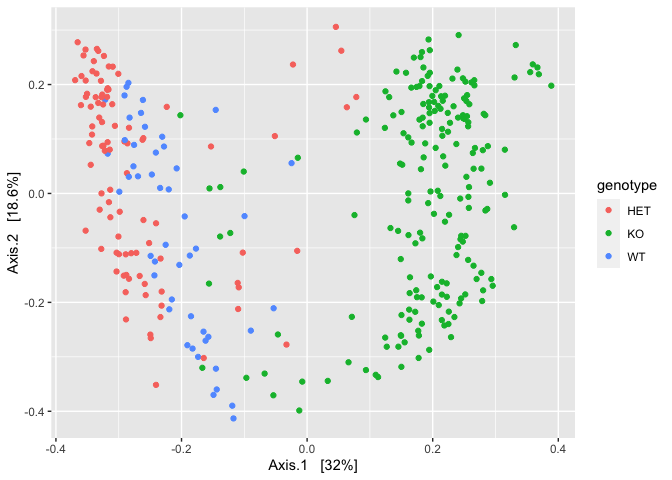
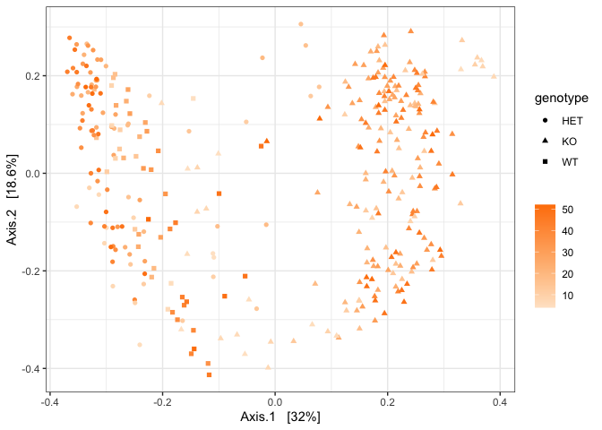
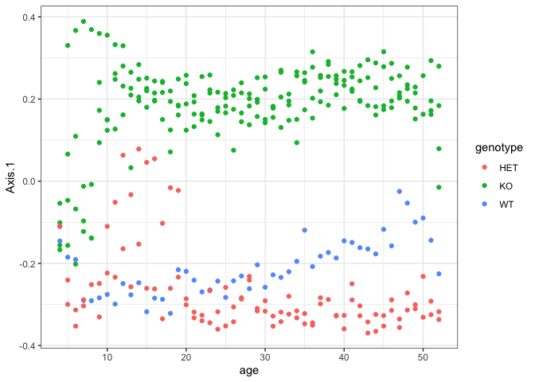
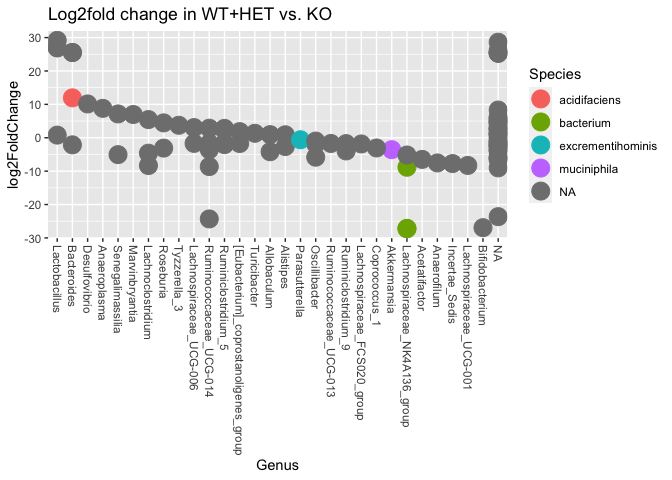

Hnf4a Manuscript Figure 6
================

Loading packages

``` r
#Loading required libraries
library(ggplot2)
library(plyr)
library(tidyverse)
```

    ## ── Attaching packages ─────────────────────────────────────── tidyverse 1.3.2 ──
    ## ✔ tibble  3.1.8      ✔ dplyr   1.0.10
    ## ✔ tidyr   1.2.1      ✔ stringr 1.4.1 
    ## ✔ readr   2.1.3      ✔ forcats 0.5.2 
    ## ✔ purrr   0.3.5      
    ## ── Conflicts ────────────────────────────────────────── tidyverse_conflicts() ──
    ## ✖ dplyr::arrange()   masks plyr::arrange()
    ## ✖ purrr::compact()   masks plyr::compact()
    ## ✖ dplyr::count()     masks plyr::count()
    ## ✖ dplyr::failwith()  masks plyr::failwith()
    ## ✖ dplyr::filter()    masks stats::filter()
    ## ✖ dplyr::id()        masks plyr::id()
    ## ✖ dplyr::lag()       masks stats::lag()
    ## ✖ dplyr::mutate()    masks plyr::mutate()
    ## ✖ dplyr::rename()    masks plyr::rename()
    ## ✖ dplyr::summarise() masks plyr::summarise()
    ## ✖ dplyr::summarize() masks plyr::summarize()

``` r
library(phyloseq) #To open phyloseq objects output by Hardac
library(RColorBrewer) 
library(pals) #Improved color palette options
library(ggpubr) #Improved ggplot functions
```

    ## 
    ## Attaching package: 'ggpubr'
    ## 
    ## The following object is masked from 'package:plyr':
    ## 
    ##     mutate

``` r
library(vegan)
```

    ## Loading required package: permute
    ## Loading required package: lattice
    ## This is vegan 2.6-2

``` r
library(DESeq2)
```

    ## Loading required package: S4Vectors
    ## Loading required package: stats4
    ## Loading required package: BiocGenerics
    ## 
    ## Attaching package: 'BiocGenerics'
    ## 
    ## The following objects are masked from 'package:dplyr':
    ## 
    ##     combine, intersect, setdiff, union
    ## 
    ## The following objects are masked from 'package:stats':
    ## 
    ##     IQR, mad, sd, var, xtabs
    ## 
    ## The following objects are masked from 'package:base':
    ## 
    ##     anyDuplicated, append, as.data.frame, basename, cbind, colnames,
    ##     dirname, do.call, duplicated, eval, evalq, Filter, Find, get, grep,
    ##     grepl, intersect, is.unsorted, lapply, Map, mapply, match, mget,
    ##     order, paste, pmax, pmax.int, pmin, pmin.int, Position, rank,
    ##     rbind, Reduce, rownames, sapply, setdiff, sort, table, tapply,
    ##     union, unique, unsplit, which.max, which.min
    ## 
    ## 
    ## Attaching package: 'S4Vectors'
    ## 
    ## The following objects are masked from 'package:dplyr':
    ## 
    ##     first, rename
    ## 
    ## The following object is masked from 'package:tidyr':
    ## 
    ##     expand
    ## 
    ## The following object is masked from 'package:plyr':
    ## 
    ##     rename
    ## 
    ## The following objects are masked from 'package:base':
    ## 
    ##     expand.grid, I, unname
    ## 
    ## Loading required package: IRanges
    ## 
    ## Attaching package: 'IRanges'
    ## 
    ## The following object is masked from 'package:phyloseq':
    ## 
    ##     distance
    ## 
    ## The following objects are masked from 'package:dplyr':
    ## 
    ##     collapse, desc, slice
    ## 
    ## The following object is masked from 'package:purrr':
    ## 
    ##     reduce
    ## 
    ## The following object is masked from 'package:plyr':
    ## 
    ##     desc
    ## 
    ## Loading required package: GenomicRanges
    ## Loading required package: GenomeInfoDb
    ## Loading required package: SummarizedExperiment
    ## Loading required package: MatrixGenerics
    ## Loading required package: matrixStats
    ## 
    ## Attaching package: 'matrixStats'
    ## 
    ## The following object is masked from 'package:dplyr':
    ## 
    ##     count
    ## 
    ## The following object is masked from 'package:plyr':
    ## 
    ##     count
    ## 
    ## 
    ## Attaching package: 'MatrixGenerics'
    ## 
    ## The following objects are masked from 'package:matrixStats':
    ## 
    ##     colAlls, colAnyNAs, colAnys, colAvgsPerRowSet, colCollapse,
    ##     colCounts, colCummaxs, colCummins, colCumprods, colCumsums,
    ##     colDiffs, colIQRDiffs, colIQRs, colLogSumExps, colMadDiffs,
    ##     colMads, colMaxs, colMeans2, colMedians, colMins, colOrderStats,
    ##     colProds, colQuantiles, colRanges, colRanks, colSdDiffs, colSds,
    ##     colSums2, colTabulates, colVarDiffs, colVars, colWeightedMads,
    ##     colWeightedMeans, colWeightedMedians, colWeightedSds,
    ##     colWeightedVars, rowAlls, rowAnyNAs, rowAnys, rowAvgsPerColSet,
    ##     rowCollapse, rowCounts, rowCummaxs, rowCummins, rowCumprods,
    ##     rowCumsums, rowDiffs, rowIQRDiffs, rowIQRs, rowLogSumExps,
    ##     rowMadDiffs, rowMads, rowMaxs, rowMeans2, rowMedians, rowMins,
    ##     rowOrderStats, rowProds, rowQuantiles, rowRanges, rowRanks,
    ##     rowSdDiffs, rowSds, rowSums2, rowTabulates, rowVarDiffs, rowVars,
    ##     rowWeightedMads, rowWeightedMeans, rowWeightedMedians,
    ##     rowWeightedSds, rowWeightedVars
    ## 
    ## Loading required package: Biobase
    ## Welcome to Bioconductor
    ## 
    ##     Vignettes contain introductory material; view with
    ##     'browseVignettes()'. To cite Bioconductor, see
    ##     'citation("Biobase")', and for packages 'citation("pkgname")'.
    ## 
    ## 
    ## Attaching package: 'Biobase'
    ## 
    ## The following object is masked from 'package:MatrixGenerics':
    ## 
    ##     rowMedians
    ## 
    ## The following objects are masked from 'package:matrixStats':
    ## 
    ##     anyMissing, rowMedians
    ## 
    ## The following object is masked from 'package:phyloseq':
    ## 
    ##     sampleNames

``` r
library(ALDEx2)
```

    ## Loading required package: zCompositions
    ## Loading required package: MASS
    ## 
    ## Attaching package: 'MASS'
    ## 
    ## The following object is masked from 'package:dplyr':
    ## 
    ##     select
    ## 
    ## Loading required package: NADA
    ## Loading required package: survival
    ## 
    ## Attaching package: 'NADA'
    ## 
    ## The following object is masked from 'package:IRanges':
    ## 
    ##     cor
    ## 
    ## The following object is masked from 'package:S4Vectors':
    ## 
    ##     cor
    ## 
    ## The following object is masked from 'package:stats':
    ## 
    ##     cor
    ## 
    ## Loading required package: truncnorm

Panel 6A PCoA plot

``` r
ps2 <- read_rds("phyloseq_lipocalin_HET-WT.rds")
ps2
```

    ## phyloseq-class experiment-level object
    ## otu_table()   OTU Table:         [ 3000 taxa and 348 samples ]
    ## sample_data() Sample Data:       [ 348 samples by 16 sample variables ]
    ## tax_table()   Taxonomy Table:    [ 3000 taxa by 7 taxonomic ranks ]
    ## phy_tree()    Phylogenetic Tree: [ 3000 tips and 2998 internal nodes ]
    ## refseq()      DNAStringSet:      [ 3000 reference sequences ]

Panel 6B PCoA plot Axis a over time with GLM statistics

The N/A sample doesn’t add much to the analysis, removing this for the
rest of the session

``` r
ps2 = subset_samples(ps2, genotype != "N/A")
```

Data preprocessing for ordination. Rare and low abundance taxa can swamp
out major trends (E.g. Genotype)

``` r
sample_min_count = 50

ps2 %>%
  prune_samples(sample_sums(.)>=sample_min_count, .) ->
  ps2.sample_prune
```

``` r
min_count = 3
min_sample_frac = 0.10

prune.vec = filter_taxa(ps2.sample_prune, 
                       function(x) sum(x >= min_count) >= (min_sample_frac*length(x)))
ps2.st_prune = prune_taxa(prune.vec, ps2.sample_prune)
ntaxa(ps2.st_prune)
```

    ## [1] 173

``` r
ps2.st_prune.even = transform_sample_counts(ps2.st_prune, function(x) 1E6 * x/sum(x))
```

``` r
ps2.st_prune.even.pcoa_bc <- ordinate(ps2.st_prune.even, "PCoA", "bray")
pltest <- plot_ordination(ps2.st_prune.even, ps2.st_prune.even.pcoa_bc, type="samples", color="genotype")
pltest
```

<!-- -->

``` r
#This changes the variable "age" to numeric
class(sample_data(ps2.st_prune.even)[["age"]]) <- "numeric"
```

``` r
p7 <- plot_ordination(ps2.st_prune.even, ps2.st_prune.even.pcoa_bc, type="samples", color="age", shape = "genotype") +
  scale_color_gradient(name = NULL,
                       high = "#FF8000",
                       low = "#FFE5CC")+ theme_bw()
p7
```

<!-- -->

Plotting just PC Axis 1 stacked over time

``` r
df_pcoa <- p7$data
head(df_pcoa)
```

    ##          Axis.1       Axis.2 X.SampleID BarcodeSequence
    ## 1   -0.15544270  0.009216896          1    CTACCGATTGCG
    ## 10  -0.11053193 -0.164322062         10    TCTCAGCGCGTA
    ## 100 -0.03286332 -0.277523707        100    TCCTCTTTGGTC
    ## 101  0.19538878  0.263039129        101    TCACCATCCGAG
    ## 103  0.28372218  0.143622259        103    TACGTACGAAAC
    ## 105  0.20468253  0.083684242        105    CTGTTACAGCGA
    ##         LinkerPrimerSequence   PrimerID mouse genotype genotype2 age cage
    ## 1   CAAGCAGAAGACGGCATACGAGAT 806rcbc672     1       KO        KO   4    1
    ## 10  CAAGCAGAAGACGGCATACGAGAT 806rcbc744    19      HET        WT   4    8
    ## 100 CAAGCAGAAGACGGCATACGAGAT 806rcbc716    19      HET        WT  13    8
    ## 101 CAAGCAGAAGACGGCATACGAGAT 806rcbc728     1       KO        KO  14    1
    ## 103 CAAGCAGAAGACGGCATACGAGAT 806rcbc740     3       KO        KO  14    1
    ## 105 CAAGCAGAAGACGGCATACGAGAT 806rcbc752     5       KO        KO  14    2
    ##       lipocalin flare                  kit       platform    libProtocol
    ## 1   27.89377857    No DNeasy PowerSoil Pro MiSeq_V2_250PE EMP16s_515_806
    ## 10       14.566    No DNeasy PowerSoil Pro MiSeq_V2_250PE EMP16s_515_806
    ## 100     47.8332    No DNeasy PowerSoil Pro MiSeq_V2_250PE EMP16s_515_806
    ## 101     128.072    No DNeasy PowerSoil Pro MiSeq_V2_250PE EMP16s_515_806
    ## 103     63.1681    No DNeasy PowerSoil Pro MiSeq_V2_250PE EMP16s_515_806
    ## 105     114.611    No DNeasy PowerSoil Pro MiSeq_V2_250PE EMP16s_515_806
    ##     samplefilter Description
    ## 1           keep          NA
    ## 10          keep          NA
    ## 100         keep          NA
    ## 101         keep          NA
    ## 103         keep          NA
    ## 105         keep          NA

Example taken from this link:
<http://www.sthda.com/english/wiki/ggplot2-scatter-plots-quick-start-guide-r-software-and-data-visualization>

``` r
p2 <- ggplot(df_pcoa, aes(x=age, y=Axis.1, color=genotype)) + geom_point() +theme_bw()

p2
```

<!-- -->

``` r
df_pcoa$age <- as.factor(df_pcoa$age)
sapply(df_pcoa, class)
```

    ##               Axis.1               Axis.2           X.SampleID 
    ##            "numeric"            "numeric"            "integer" 
    ##      BarcodeSequence LinkerPrimerSequence             PrimerID 
    ##          "character"          "character"          "character" 
    ##                mouse             genotype            genotype2 
    ##            "integer"          "character"          "character" 
    ##                  age                 cage            lipocalin 
    ##             "factor"          "character"          "character" 
    ##                flare                  kit             platform 
    ##          "character"          "character"          "character" 
    ##          libProtocol         samplefilter          Description 
    ##          "character"          "character"            "logical"

``` r
model_pcoa <- glm(df_pcoa$Axis.1 ~ genotype2 + age, data = df_pcoa)
```

``` r
summary(model_pcoa)$coef
```

    ##                 Estimate Std. Error      t value      Pr(>|t|)
    ## (Intercept)  0.067078016 0.03688706   1.81847029  7.003091e-02
    ## genotype2WT -0.437138317 0.01066138 -41.00204562 3.032173e-122
    ## age5         0.044307587 0.05176442   0.85594672  3.927388e-01
    ## age6         0.027386676 0.05176442   0.52906368  5.971688e-01
    ## age7         0.016702377 0.05176442   0.32266132  7.471859e-01
    ## age8         0.002325978 0.05388769   0.04316344  9.656012e-01
    ## age9         0.120665756 0.05176442   2.33105581  2.044055e-02
    ## age10        0.144408308 0.05176442   2.78972124  5.627238e-03
    ## age11        0.175246410 0.05176442   3.38546058  8.093239e-04
    ## age12        0.213428124 0.05176442   4.12306591  4.894990e-05
    ## age13        0.144162183 0.05176442   2.78496653  5.708182e-03
    ## age14        0.207405845 0.05176442   4.00672580  7.844534e-05
    ## age15        0.169413424 0.05176442   3.27277727  1.194708e-03
    ## age16        0.171462978 0.05176442   3.31237115  1.043160e-03
    ## age17        0.138059796 0.05176442   2.66707886  8.084227e-03
    ## age18        0.121894121 0.05176442   2.35478570  1.920449e-02
    ## age19        0.164057752 0.05176442   3.16931487  1.692524e-03
    ## age20        0.120501001 0.05176442   2.32787301  2.061153e-02
    ## age21        0.092379722 0.05176442   1.78461806  7.537581e-02
    ## age22        0.090762604 0.05176442   1.75337810  8.060096e-02
    ## age23        0.115269412 0.05176442   2.22680767  2.673332e-02
    ## age24        0.085638477 0.05176442   1.65438873  9.913795e-02
    ## age25        0.102003003 0.05176442   1.97052337  4.973602e-02
    ## age26        0.090397798 0.05176442   1.74633068  8.181969e-02
    ## age27        0.115094279 0.05176442   2.22342440  2.696305e-02
    ## age28        0.120291414 0.05176442   2.32382415  2.083085e-02
    ## age29        0.116266302 0.05176442   2.24606589  2.545778e-02
    ## age30        0.106676826 0.05176442   2.06081362  4.021858e-02
    ## age31        0.089831778 0.05176442   1.73539613  8.374033e-02
    ## age32        0.116813919 0.05176442   2.25664491  2.477987e-02
    ## age33        0.108382063 0.05176442   2.09375589  3.715600e-02
    ## age34        0.109322874 0.05176442   2.11193074  3.555339e-02
    ## age35        0.139696499 0.05176442   2.69869716  7.372260e-03
    ## age36        0.126716963 0.05176442   2.44795476  1.496384e-02
    ## age37        0.142876751 0.05176442   2.76013418  6.148334e-03
    ## age38        0.170855179 0.05388769   3.17057927  1.685425e-03
    ## age39        0.136334607 0.05176442   2.63375116  8.901118e-03
    ## age40        0.133386725 0.05176442   2.57680314  1.046979e-02
    ## age41        0.159603574 0.05176442   3.08326776  2.245937e-03
    ## age42        0.137939459 0.05176442   2.66475416  8.138939e-03
    ## age43        0.127291880 0.05388350   2.36235358  1.882434e-02
    ## age44        0.118972030 0.05176442   2.29833592  2.225903e-02
    ## age45        0.142376999 0.05176442   2.75047983  6.327592e-03
    ## age46        0.141759033 0.05176442   2.73854180  6.555785e-03
    ## age47        0.143802411 0.05176442   2.77801635  5.828402e-03
    ## age48        0.162088667 0.05176442   3.13127552  1.919464e-03
    ## age49        0.129262401 0.05176442   2.49712825  1.307879e-02
    ## age50        0.148651027 0.05673453   2.62011563  9.256176e-03
    ## age51        0.129217753 0.05176442   2.49626573  1.310995e-02
    ## age52        0.070103748 0.05176442   1.35428438  1.767073e-01

``` r
#Writing to dataframe 
df_pcoa_genotype2 <- as.data.frame(summary(model_pcoa)$coef)
head(df_pcoa_genotype2)
```

    ##                 Estimate Std. Error      t value      Pr(>|t|)
    ## (Intercept)  0.067078016 0.03688706   1.81847029  7.003091e-02
    ## genotype2WT -0.437138317 0.01066138 -41.00204562 3.032173e-122
    ## age5         0.044307587 0.05176442   0.85594672  3.927388e-01
    ## age6         0.027386676 0.05176442   0.52906368  5.971688e-01
    ## age7         0.016702377 0.05176442   0.32266132  7.471859e-01
    ## age8         0.002325978 0.05388769   0.04316344  9.656012e-01

DESeq2 analysis of WT+HET vs KO

``` r
hnfdds2 <- phyloseq_to_deseq2(ps2, ~ genotype2)
```

    ## converting counts to integer mode

    ## Warning in DESeqDataSet(se, design = design, ignoreRank): some variables in
    ## design formula are characters, converting to factors

``` r
hnfdds2
```

    ## class: DESeqDataSet 
    ## dim: 3000 338 
    ## metadata(1): version
    ## assays(1): counts
    ## rownames(3000): seq_1 seq_2 ... seq_2999 seq_3000
    ## rowData names(0):
    ## colnames(338): 1 10 ... 97 99
    ## colData names(16): X.SampleID BarcodeSequence ... samplefilter
    ##   Description

``` r
# First we remove rows with very few counts E.g. 5
hnfdds2 <- hnfdds2[ rowSums(counts(hnfdds2)) > 5, ]
```

``` r
cts <- counts(hnfdds2)
geoMeans <- apply(cts, 1, function(row) if (all(row == 0)) 0 else exp(mean(log(row[row != 0]))))
dds3 <- estimateSizeFactors(hnfdds2, geoMeans=geoMeans)
```

``` r
dds3 <- DESeq(dds3, test = "Wald", fitType = "parametric")
```

    ## using pre-existing size factors

    ## estimating dispersions

    ## gene-wise dispersion estimates

    ## mean-dispersion relationship

    ## final dispersion estimates

    ## fitting model and testing

    ## -- replacing outliers and refitting for 292 genes
    ## -- DESeq argument 'minReplicatesForReplace' = 7 
    ## -- original counts are preserved in counts(dds)

    ## estimating dispersions

    ## fitting model and testing

``` r
resultsNames(dds3)
```

    ## [1] "Intercept"          "genotype2_WT_vs_KO"

``` r
#Using the results table in Deseq2 to create a table with significant results for plotting and viewing this table to ensure it is properly formatted
res = results(dds3, cooksCutoff = FALSE)
alpha = 0.01
sigtab = res[which(res$padj < alpha), ]
sigtab = cbind(as(sigtab, "data.frame"), as(tax_table(ps2)[rownames(sigtab), ], "matrix"))
head(sigtab)
```

    ##        baseMean log2FoldChange      lfcSE      stat       pvalue         padj
    ## seq_1 2333.1935     -3.5707316 0.36769016 -9.711252 2.700009e-22 3.962661e-21
    ## seq_2 1161.6913      0.7925653 0.16243823  4.879179 1.065281e-06 8.305863e-06
    ## seq_4  824.0617      0.9367997 0.20195668  4.638617 3.507485e-06 2.612291e-05
    ## seq_5  605.4423      0.9959654 0.08930971 11.151816 7.016000e-29 1.129350e-27
    ## seq_7  563.1585      1.3352437 0.43014282  3.104187 1.908028e-03 9.521058e-03
    ## seq_8  330.2800      1.2901207 0.08890814 14.510716 1.036339e-47 2.068533e-46
    ##        Kingdom          Phylum            Class              Order
    ## seq_1 Bacteria Verrucomicrobia Verrucomicrobiae Verrucomicrobiales
    ## seq_2 Bacteria      Firmicutes          Bacilli    Lactobacillales
    ## seq_4 Bacteria      Firmicutes Erysipelotrichia Erysipelotrichales
    ## seq_5 Bacteria   Bacteroidetes      Bacteroidia      Bacteroidales
    ## seq_7 Bacteria      Firmicutes Erysipelotrichia Erysipelotrichales
    ## seq_8 Bacteria   Bacteroidetes      Bacteroidia      Bacteroidales
    ##                          Family         Genus     Species
    ## seq_1       Verrucomicrobiaceae   Akkermansia muciniphila
    ## seq_2          Lactobacillaceae Lactobacillus        <NA>
    ## seq_4       Erysipelotrichaceae   Allobaculum        <NA>
    ## seq_5 Bacteroidales_S24-7_group          <NA>        <NA>
    ## seq_7       Erysipelotrichaceae  Turicibacter        <NA>
    ## seq_8 Bacteroidales_S24-7_group          <NA>        <NA>

``` r
dim(sigtab)
```

    ## [1] 100  13

``` r
#Saving lipocalin flaring Deseq object as tab separated values
#write.table(sigtab, file = "Deseq2_HET-WT_vs_KO_6-18-2020_V2.tsv", row.names=TRUE, sep="\t")
```

``` r
#Which comparison is being made? This code shows that it is flare condition "Yes" vs "No"
#The second line of code dim(sigtab) shows that there are 56 differential taxa
resultsNames(dds3)
```

    ## [1] "Intercept"          "genotype2_WT_vs_KO"

``` r
dim(sigtab)
```

    ## [1] 100  13

``` r
#Just coloring by species, 6-18-2020, repeating this with the genotype 2 label
x = tapply(sigtab$log2FoldChange, sigtab$Phylum, function(x) max(x))
x = sort(x, TRUE)
sigtab$Phylum = factor(as.character(sigtab$Phylum), levels=names(x))
# Genus order
x = tapply(sigtab$log2FoldChange, sigtab$Genus, function(x) max(x))
x = sort(x, TRUE)
sigtab$Genus = factor(as.character(sigtab$Genus), levels=names(x))
ds2 <- ggplot(sigtab, aes(x=Genus, y=log2FoldChange, color=Species)) + geom_point(size=6) + 
  theme(axis.text.x = element_text(angle = -90, hjust = 0, vjust=0.5))
ds2 + ggtitle("Log2fold change in WT+HET vs. KO")
```

<!-- -->

ALDEx2 correlation of Log2(Lcn2) vs. CLR transformed ASV counts

``` r
ps <- read_rds("phyloseq_hetgroup_log2lipo-diarrhea-factor-10-2020.rds")
ps
```

    ## phyloseq-class experiment-level object
    ## otu_table()   OTU Table:         [ 3000 taxa and 348 samples ]
    ## sample_data() Sample Data:       [ 348 samples by 20 sample variables ]
    ## tax_table()   Taxonomy Table:    [ 3000 taxa by 7 taxonomic ranks ]
    ## phy_tree()    Phylogenetic Tree: [ 3000 tips and 2998 internal nodes ]
    ## refseq()      DNAStringSet:      [ 3000 reference sequences ]

Correlation (Spearman) of Delta Log2(Lcn2) vs. Delta ASVs

Panel 6C Relative Abundance of top 20 ASV for each mouse over 52 Weeks
